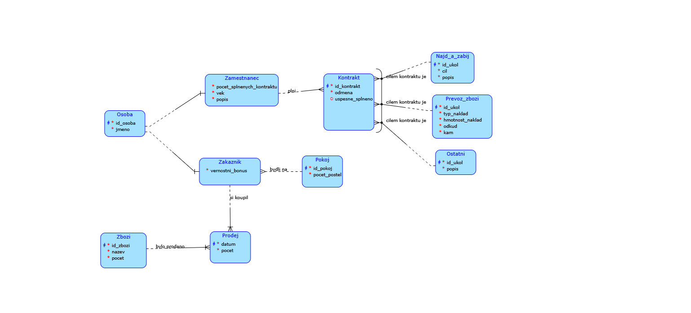
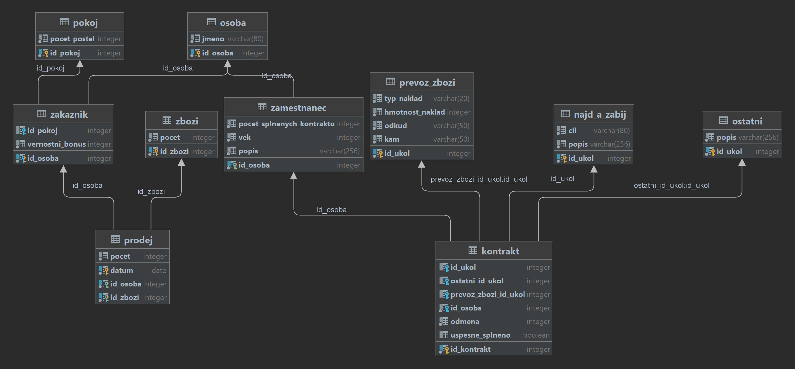

# Semestrální práce z předmětu Databázové systémy: Lazarova hospoda

## Popis

V dobrodružném vesmíru počítačové hry Lazarovi Parťáci žije Lazar princ J-Manovy říše. Po životě plném hrdinských činů se rozhodl že svá zlatá léta hodlá dožít v klidu. Proto si ve vysokém věku 31 let otevřel svou vesmírnou hospůdku. Pro spravný chod bude potřebovat vymakanou databazi.

Jelikož se hodlá věnovat i prodeji a směně unikátního Zboží a vzácnosti bude muset zaznamenávat co vlastni a chce prodat. Bude pro něj duležité hlavně za kolik, komu a kdy předmět prodal.

Lazar se ve svém volném čase také rád zabýva organizovaním vesmírných kontraktů proto je potřeba zaznamenávat kontrakty které mužou plnit pracovnici na volne noze. Jednotlivé vesmírné kontrakty budou detailně rezepsany do nejmenších podrobností aby se pracovníci mohli informovaně rozhodnout zda ukol přijmou, jestli je k splnění potřeba vybavení případně zda ukol vyzaduje tým pracovníků. Kontrakt bude obsahovat informaci o výši odměny a bude označený podle stavu. V kontraktu bude zaznamenáno zda byl úspěšně dokončen.

Vesmírný kontrakt bude vždy mezi Lazarem a jednotlivými zaměstnanci a musí se týkat právě jednoho úkolu na kterém může zaměstnanec pracovat sám a nebo může spolupracovat s dalšími zaměstnanci. Lazarova hospoda nabízí dva standardní typy úkolu najdi a zneškodno nebo převoz zboží. Pokud úkol nelze zařadit do standardní kategorie je zařazen do kategorie ostatní. Jednotlivé úkoly budou obsahovat již zmíněné specifikace a budou vystaveny na tabuli úkolů v hospodě tak aby každý mohl zvážit zda jej chce plnit.

K vesmírným kontraktům se budou moci přihlašovat Zaměstnanci. U zaměstnance budou podstatné jeho osobní informace (jméno, příjmení, osobní identifikator obcana J-Manovy Říše (OIOJR) a počet splněných úkolů) a podle jejich počtu splněných prací se bude rozhodovat o bonusech.

Zákazník bude kdokoliv kdo si koupí nějaké zboží nebo pronajme pokoj.

V hospodě je možné si rezervovat pokoj. O pokoji bude v databázi zaznamenána jeho velikost, počet postelí a zda je v ceně zahrnuta údrzba. Pokoj si může rezervovat jednotlvý zakazník.

## Diagram

## Relační schéma

